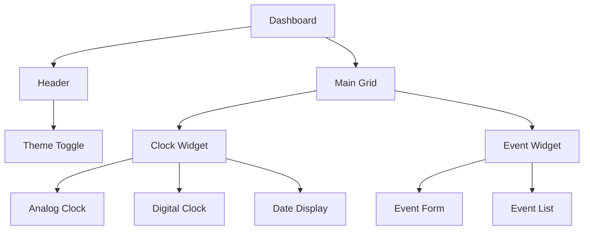
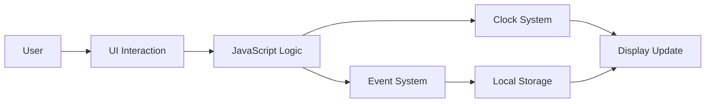
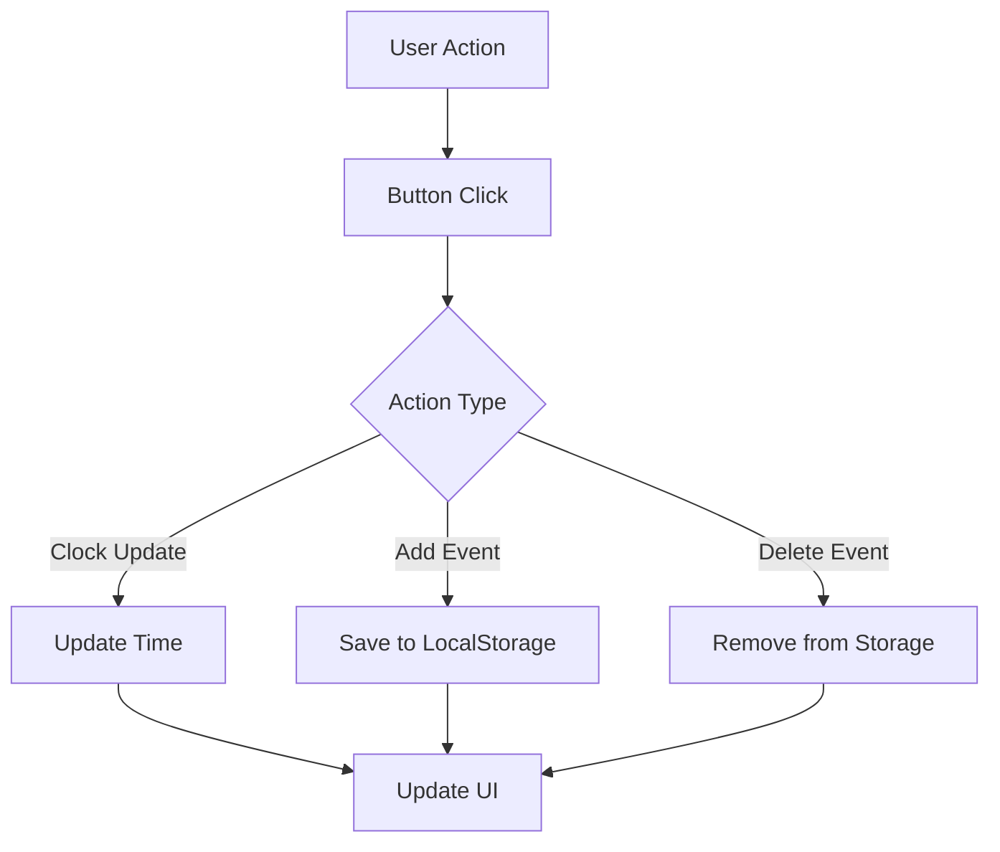

# ⏰ Smart Clock Dashboard

A modern and interactive **Smart Clock Dashboard** built using HTML, CSS, and JavaScript.
This project combines an **analog + digital clock**, **event reminder system**, and a **beautiful glassmorphism UI**.

---

## 🚀 Features

* 🕒 Real-time Analog Clock
* ⌚ Digital Clock Display
* 📅 Date & Day Display
* 📝 Event Reminder System
* 🌙 Dark Mode Toggle
* 💾 Local Storage (save events)
* 🎨 Modern Glass UI Design

---

## 🎨 UI / UX Design

The UI is designed with a modern approach:

* ✨ Glassmorphism design panels
* 🌈 Gradient animated background
* 📱 Fully responsive layout
* 🎯 Clean dashboard structure
* 🌙 Dark / Light mode support

---

## 🖥️ UI Layout Structure



---

## 🏗️ Application Architecture



---

## 🔄 Workflow Diagram



---

## 🛠️ Technologies Used

* HTML5
* CSS3
* JavaScript (Vanilla JS)

---

## 📂 Project Structure

```bash id="struct123"
smart-clock-dashboard/
│── index.html
│── style.css
│── script.js
```

---

## ⚙️ How It Works

* Clock updates every second using JavaScript
* Events are stored using **localStorage**
* UI updates dynamically without reload
* Dark mode toggles using CSS variables

---

## ▶️ Run the Project

1. Download or clone the repository
2. Open `index.html` in browser

---

## 📸 Screenshot

```md id="img123"

```

---

## 🎯 Key Highlights

* Real-time clock synchronization
* Persistent event storage
* Smooth UI animations
* Clean and modular code structure

---

## 👨‍💻 Author

**Ravi Singh**
Frontend Developer

---

## ⭐ Support

If you like this project, give it a ⭐ on GitHub!
